# Gambia Health & Development

65 years of Gambian indicators pulled from the World Bank. Cleaned, charted, and written up for anyone who wants a quick read on where the country has been since 1960.

This is a personal project. I am a Statistics student at KNUST and wanted to apply pandas and matplotlib to data about my own country instead of another textbook dataset.

## What's inside

- 19 indicators across health, education, economy, and demographics
- 13 figures
- A short writeup of what the data shows
- Findings and a few recommendations at the bottom

## How to run it

```
pip install -r requirements.txt
python src/fetch_data.py
python src/clean.py
python src/plots.py
```

Or open `notebooks/gambia_analysis.ipynb` and run the cells top to bottom.

## The headline numbers

| Indicator | Earliest | Latest | Change |
|---|---|---|---|
| Life expectancy | 34.6 yrs (1960) | 66.1 yrs (2024) | +91% |
| Infant mortality | 157 per 1,000 (1960) | 33 per 1,000 (2024) | -79% |
| Maternal mortality | 1,454 per 100k (1985) | 354 per 100k (2023) | -76% (still high) |
| Fertility rate | 6.3 (1960) | 3.9 (2024) | -37% |
| Primary enrolment (gross) | 21% (1971) | 100% (2025) | +369% |
| Secondary enrolment (gross) | 7% (1971) | 107% (2021) | +1,434% |
| GDP per capita (current US$) | $94 (1966) | $871 (2024) | +823% |
| GDP per capita PPP | $1,409 (1990) | $3,476 (2024) | +147% |
| Inflation (latest) | - | 11.6% (2024) | volatile |
| Remittances received | $0.3M (1978) | $529M (2024) | huge |
| Population | 398k (1960) | 2.76M (2025) | +593% |
| Urban share | 9% (1960) | 64% (2025) | +609% |

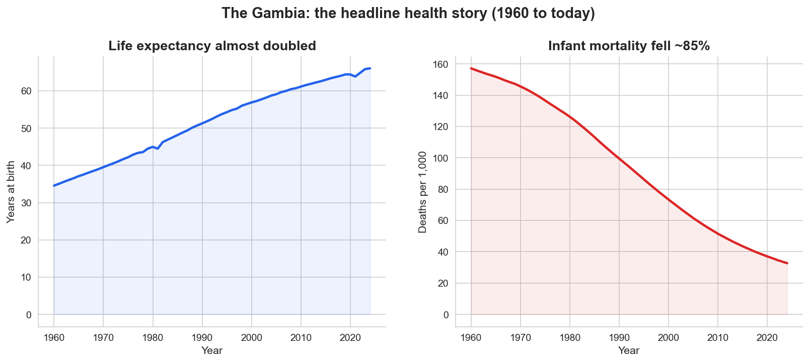

## What the data says

### Life expectancy almost doubled

A baby born in 1960 could expect to live 35 years. Today, 66. The line is mostly steady upward with a small dip around the early 90s.

The strongest correlation with life expectancy is infant mortality, with r close to -1 (-0.997). They mirror each other almost exactly. Save the babies and the country lives longer.

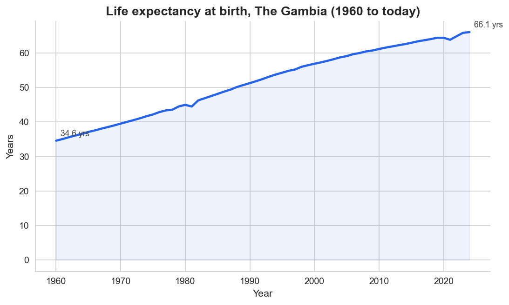

### Infant mortality fell from a tragedy to manageable

157 babies per 1,000 dying before their first birthday in 1960. Today, 33. Sub-Saharan Africa overall sits around 50 and the world average is 27, so we are not at the global average yet but the trajectory is right.

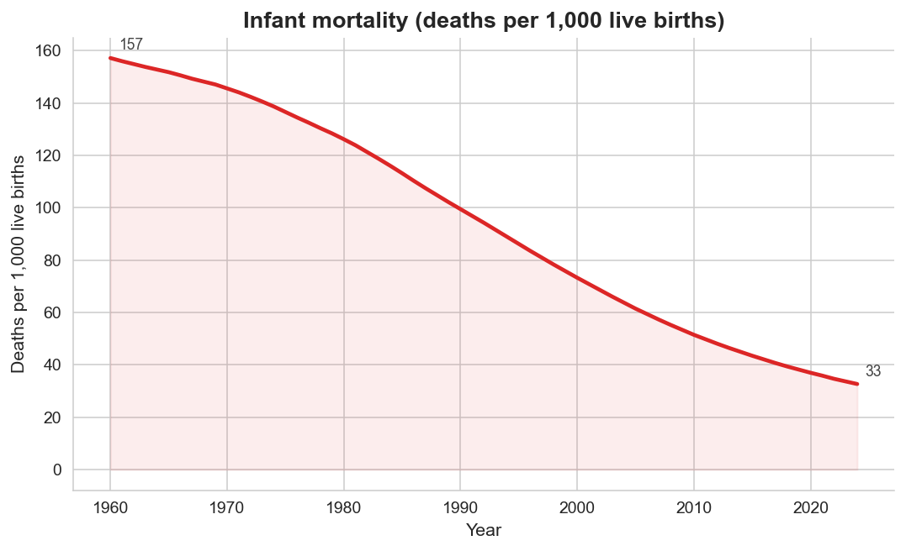

### Maternal mortality is the unfinished work

We dropped from 1,454 per 100k in 1985 to 354 in 2023. That is a 76% reduction which is real progress. But 354 is still about 35 times the OECD average, which is around 10. This is the single biggest health gap that remains.

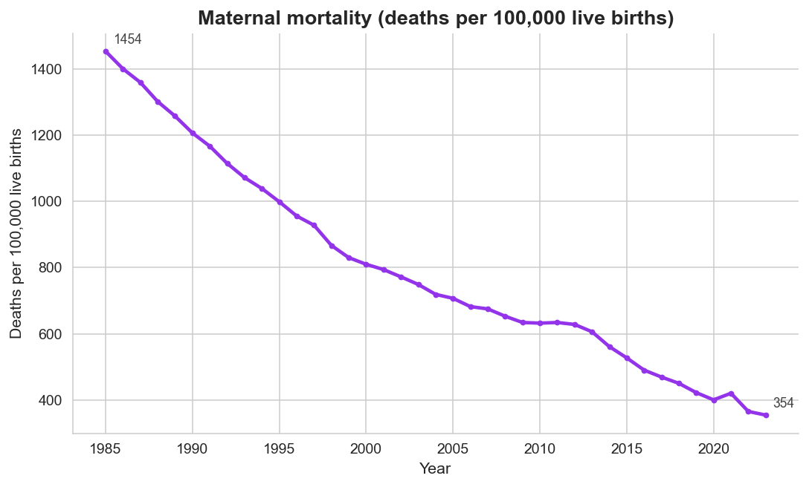

### Schools went from rare to default

In 1971 fewer than 1 in 5 primary-age children were enrolled. Today the gross enrolment ratio is 100%. Secondary went from 7% to 107%. That is the single largest social investment of the post-independence era.

What the chart cannot tell us is whether students are actually learning. Gross enrolment is a head count, not a results count. The adult literacy series only has 4 data points in 65 years which is itself a finding.

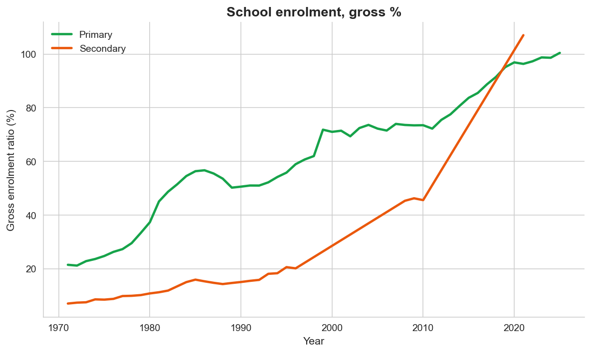

### Vaccinations are good, slipping a bit

Measles immunization moved from 69% in 1980 to a peak above 90% in the 2000s, then drifted back to 83% in 2024. Below 90% is where measles outbreaks become possible.

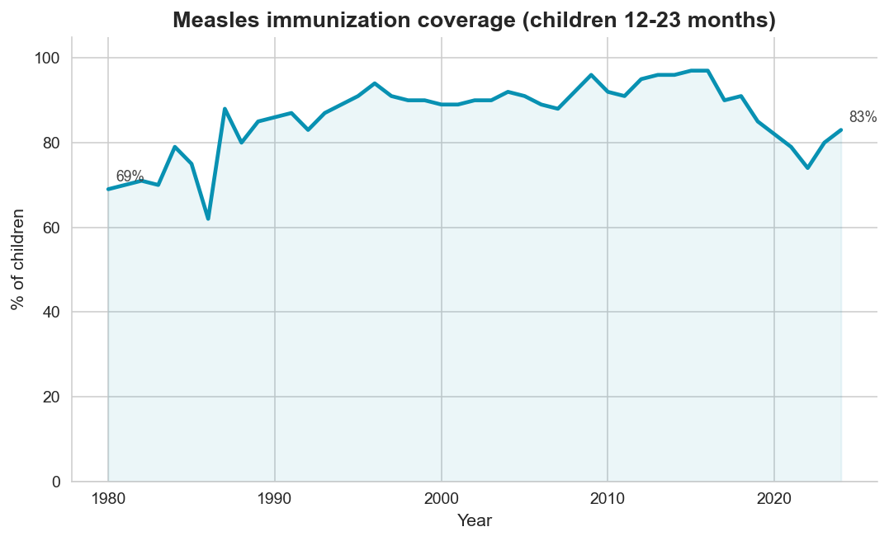

### Richer in dollars but inflation eats most of it

GDP per capita went from $94 in 1966 to $871 in 2024 in current US dollars, almost 9x larger nominally. In PPP terms (what the money buys) per capita income roughly doubled since 1990.

But inflation in 2024 was 11.6%. Six episodes of inflation above 15% since 1980. Two episodes of negative GDP growth in that span. The economy grew but with sharp shocks every decade or so.

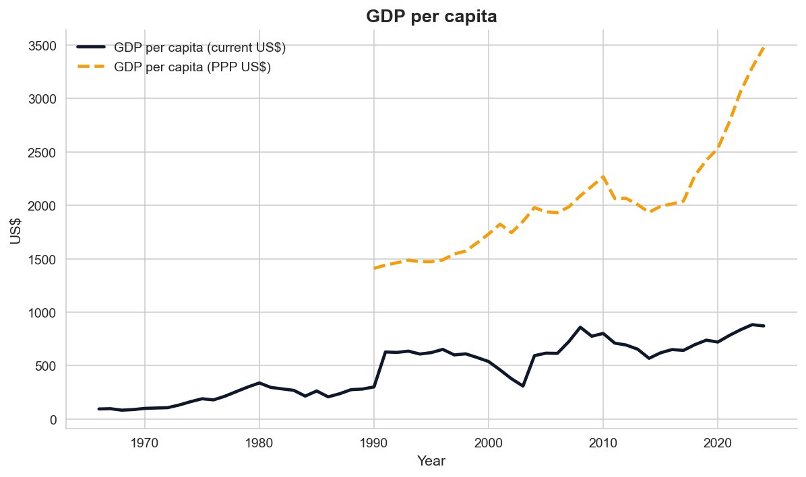
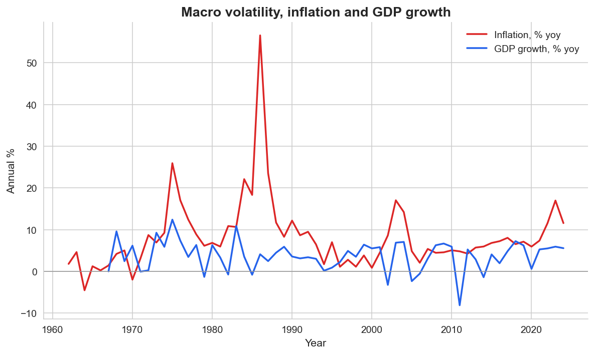

### The diaspora is now a sector

Remittances received grew from a rounding error in 1978 to $529 million in 2024, roughly 22% of GDP. Gambians abroad are the country's biggest non-government source of foreign currency.

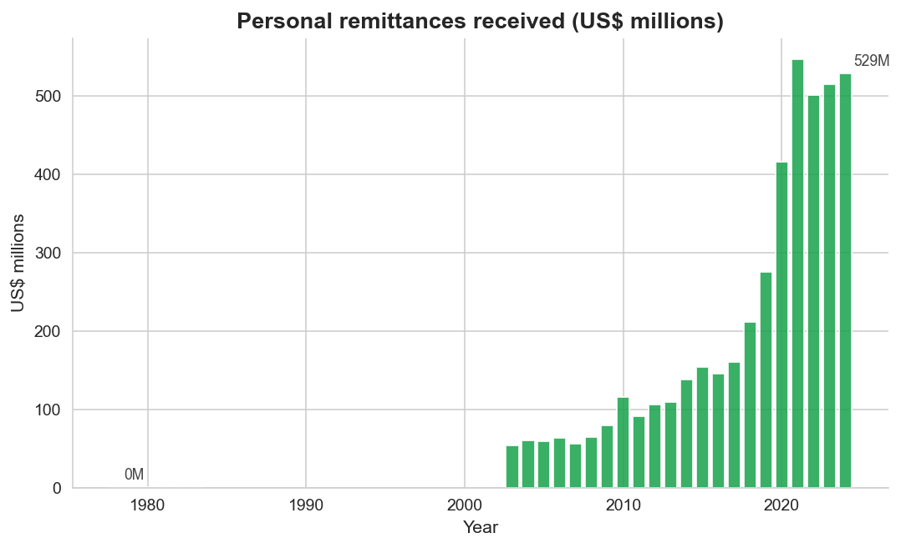

### Urbanization is the underrated megatrend

In 1960 about 91% of Gambians lived in villages. Today only 36% do. A 64% urban majority in 65 years is one of the fastest urbanization rates in West Africa.

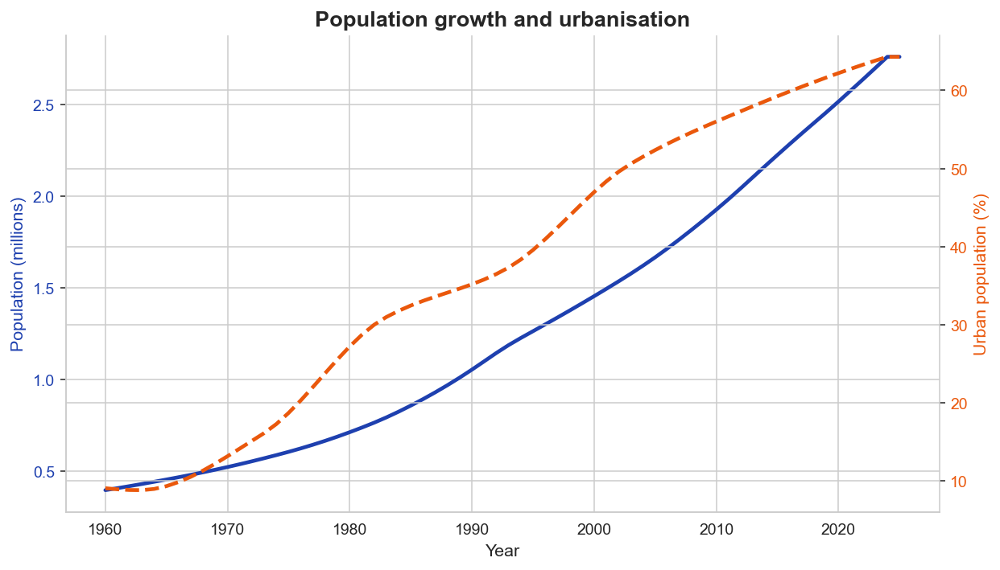

### Indicators move together

The correlation matrix shows what most people guess. Health, school enrolment, urbanization and GDP per capita all rise in step. Inflation and growth volatility move on their own clock.

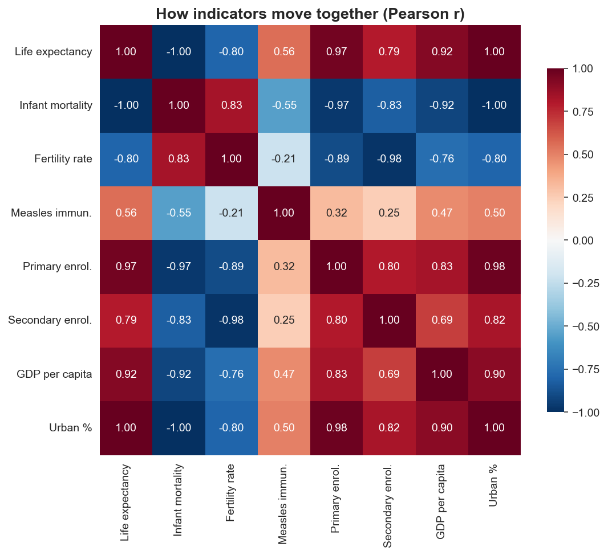
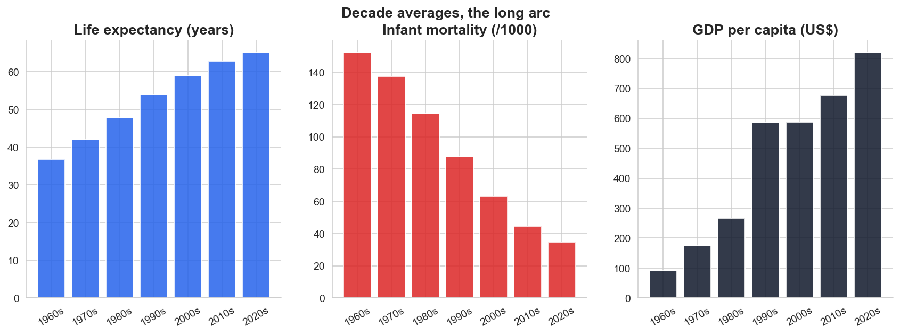

## Findings

1. The biggest single driver of longer life in The Gambia is fewer babies dying. Almost everything else follows from that.
2. Maternal mortality is still 35x the OECD average. It is the next big public-health goal.
3. Schools are full but we don't have enough learning-outcome data to know how well it is going.
4. The economy grew nearly 10x but inflation eats most of it.
5. The diaspora is the second-largest sector of the economy.
6. We urbanized faster than almost any other indicator improved.

## Recommendations

- **Ministry of Health:** treat maternal mortality as the headline number, public dashboards, year-on-year targets.
- **Ministry of Basic and Secondary Education:** standardized learning-outcome assessments at grades 3, 6, 9, published annually.
- **Gambia Bureau of Statistics:** an adult-literacy survey at least every 3 years.
- **Central Bank:** anchor inflation expectations.
- **Diaspora ministry:** push remittance fees down. A 1pp drop is roughly $5M a year going to families instead of intermediaries.
- **Urban planners:** build for the 64%, not the 36%.

## Source

All data from the World Bank Open Data API via the `wbdata` Python client. Country code GMB. Indicator codes are in `src/fetch_data.py`. Latest pull: 2025.

## Author

Abdoulie Balisa, BSc Statistics, KNUST.
